# Sistema de Aquisição de Dados para Medição de Células de Bateria de Baixa Tensão

> **Autor:** Lucas Porto Ribeiro
> **Resumo:** Sistema dedicado ao monitoramento contínuo, escalável e de baixo custo para aquisição de bioeletricidade na ordem de milivolts, focado em células a combustível microbianas (MFCs).

---

## 📖 Introdução

As células a combustível microbianas (MFCs) são tecnologias bioeletroquímicas que utilizam microrganismos como biocatalisadores para converter a energia química de substratos orgânicos diretamente em energia elétrica. Aplicações em geração de energia renovável, tratamento de efluentes e biossensores são vastas.

A atividade metabólica desses microrganismos faz com que a tensão gerada oscile ao longo do tempo, o que torna o **monitoramento contínuo** indispensável. O principal desafio é registrar múltiplas tensões de forma simultânea e precisa na escala de milivolts, uma vez que data loggers comerciais de alta precisão são onerosos e multímetros manuais não oferecem escalabilidade.

Este projeto propõe uma arquitetura baseada no microcontrolador ESP32 para medir **12 canais simultâneos**, superando limitações de custo e hardware, automatizando o envio de dados para a nuvem.

---

## 🛠️ Hardware Necessário (Material Utilizado)

Para montar a solução, os componentes foram divididos em duas categorias. A subseção **Hardware Principal** lista os itens essenciais para o processamento de dados e funcionamento lógico do sistema; com estes componentes já é possível rodar a solução desenvolvida. Já a subseção **Hardware de Integração** abrange os itens complementares necessários para alimentação, montagem e transformação do circuito em um equipamento físico funcional.

### Hardware Principal

*   **Microcontrolador ESP32:** O cérebro do projeto. Fornece processamento, interface Wi-Fi e hospeda a página web local (Servidor Web) para acompanhamento em tempo real.
*   **Conversor Analógico-Digital (ADC) ADS1115:** Garante uma resolução de 16 bits. É essencial porque o ADC interno do ESP32 possui comportamento não linear e resolução menor. Sua precisão varia conforme o ganho configurado, indo de 0,0078125 mV por bit (ganho de 16×) até 0,1875 mV por bit (ganho de 2/3×), permitindo adequar a resolução à faixa de tensão medida.
*   **2x Multiplexadores CD74HC4067:** Multiplexadores analógicos de 16 canais que atuam como "chaves seletoras". Como o ADS1115 tem canais limitados, os multiplexadores expandem o sistema para os 12 pares (positivo e negativo) necessários.

### Hardware de Integração

*   **Bateria de Lítio 18650 Recarregável:** Fornece a tensão autônoma necessária para a alimentação do sistema.
*   **Suporte (Case) para Bateria 18650:** Utilizado para acoplar a bateria ao circuito.
*   **Módulo TP4056:** Módulo responsável pelo carregamento da bateria de lítio.
*   **Módulo Step-Up MT3608:** Regulador de tensão utilizado para elevar a tensão de saída da bateria para 5V, mantendo-a constante e estável.
*   **Botão (Chave Liga/Desliga):** Permite ligar e desligar o equipamento.
*   **LED:** Utilizado para sinalizar visualmente o status (ligado/desligado) do sistema.
*   **Resistor de 220Ω:** Para limitar a corrente elétrica direcionada ao LED.
*   **8x Conectores KRE (3 terminais):** Servem como portas de conexão seguras dos cabos provenientes dos 24 béqueres biológicos.
*   **Conectores JST-XH (Macho e Fêmea):** Facilitam a conexão da alimentação na placa principal.
*   **Barras de Pinos Fêmea (Cabeçotes):** Utilizadas para acoplar os componentes à placa. Quantidades utilizadas: 2 fileiras de 16 pinos, 2 fileiras de 15 pinos, 1 fileira de 10 pinos e 2 fileiras de 8 pinos.
*   **Placa de Cobre:** Base para acomodação dos componentes e roteamento das trilhas elétricas.

---

## 🔌 Esquema de Conexão

A aquisição é baseada na leitura diferencial em pares. A conexão lógica se dá da seguinte forma:

1.  As saídas de sinal dos béqueres entram diretamente nos pinos de entrada dos dois **CD74HC4067** (um gerencia a polaridade positiva, o outro a negativa).
2.  O **ESP32** comanda a seleção de canal (através dos pinos `S0`, `S1`, `S2` e `S3`, mapeados para os GPIOs 32, 33, 25 e 26), de modo síncrono nos dois multiplexadores.
3.  As saídas comuns dos multiplexadores são conectadas ao GND e ao pino `A0` do **ADS1115**.
4.  O **ADS1115** realiza a conversão com alta resolução e trafega os dados digitais de volta ao **ESP32** utilizando o protocolo **I2C** (SDA e SCL).

### Modelagem do Circuito

Abaixo, é possível visualizar o diagrama esquemático do circuito, projetado e montado utilizando a ferramenta EasyEDA, detalhando as ligações elétricas entre os componentes:

  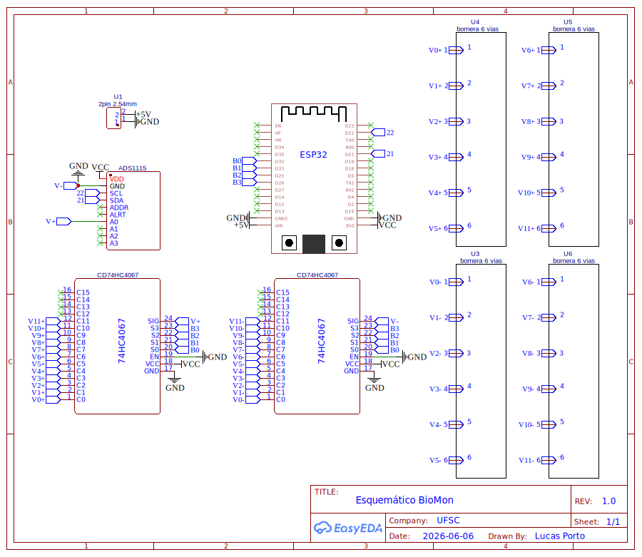

Com base no esquemático, o design da placa de circuito impresso (PCB) foi elaborado. A seguir, apresentamos o planejamento das trilhas elétricas (roteamento) lado a lado com a renderização 3D da PCB desenvolvida, mostrando a disposição física final dos conectores e módulos:

  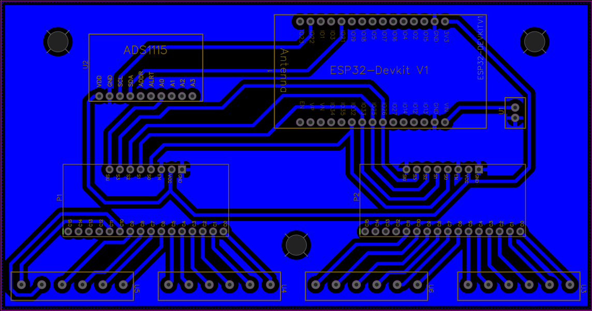
  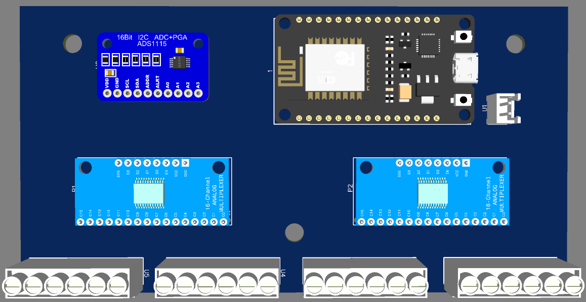

---

## ⚙️ Instalação

### Software
O software foi desenvolvido em C++. Seu fluxo de funcionamento, desde a leitura dos sensores até a transmissão dos dados, é apresentado no diagrama de blocos a seguir.

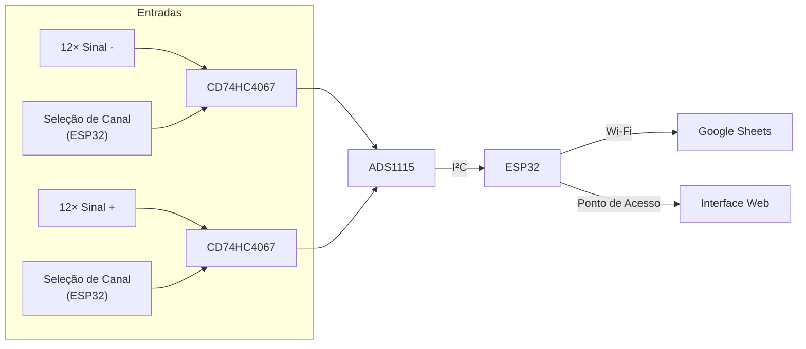

**Bibliotecas e Ferramentas Necessárias:**
*   Placa ESP32 Instalada na Arduino IDE.
*   Biblioteca `WiFi.h` (Nativa) e `Preferences.h` (Nativa).
*   Biblioteca `Adafruit_ADS1X15` (Comunicação com ADC).
*   Biblioteca `ESP_Google_Sheet_Client` (Acesso e autenticação segura com Google Cloud).
*   Biblioteca `mongoose_glue.h` (Servidor Web Embarcado - Mongoose Wizard).

## Instalação

1. Clone este repositório para o seu computador.
2. Abra o arquivo `wizard.ino` na Arduino IDE.
3. Preencha as variáveis do Google Sheets (`PROJECT_ID`, `CLIENT_EMAIL` e `PRIVATE_KEY`) com as credenciais da sua Google Service Account.
4. Compile e faça o upload do código para o ESP32.

  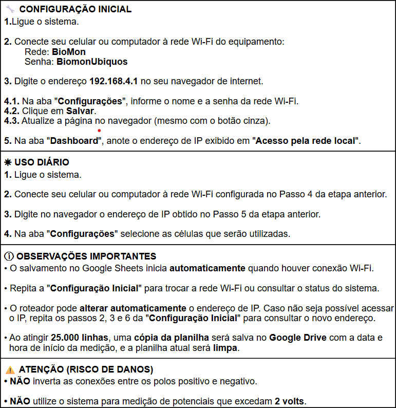

---

## 🚀 Projeto Final

Após a integração de todo o hardware e software, o equipamento foi montado em sua estrutura definitiva. A imagem abaixo apresenta o sistema físico final desenvolvido e pronto para uso:

  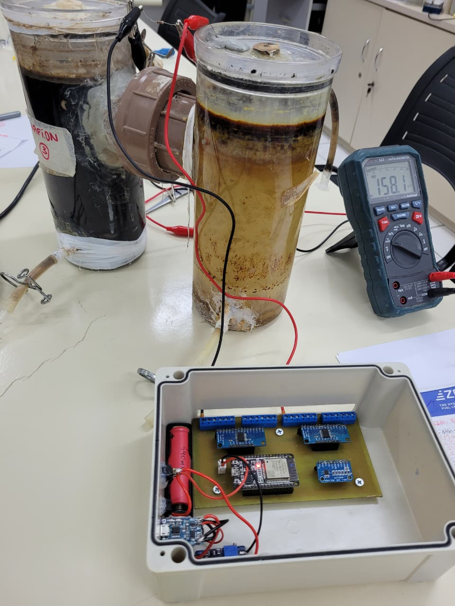
  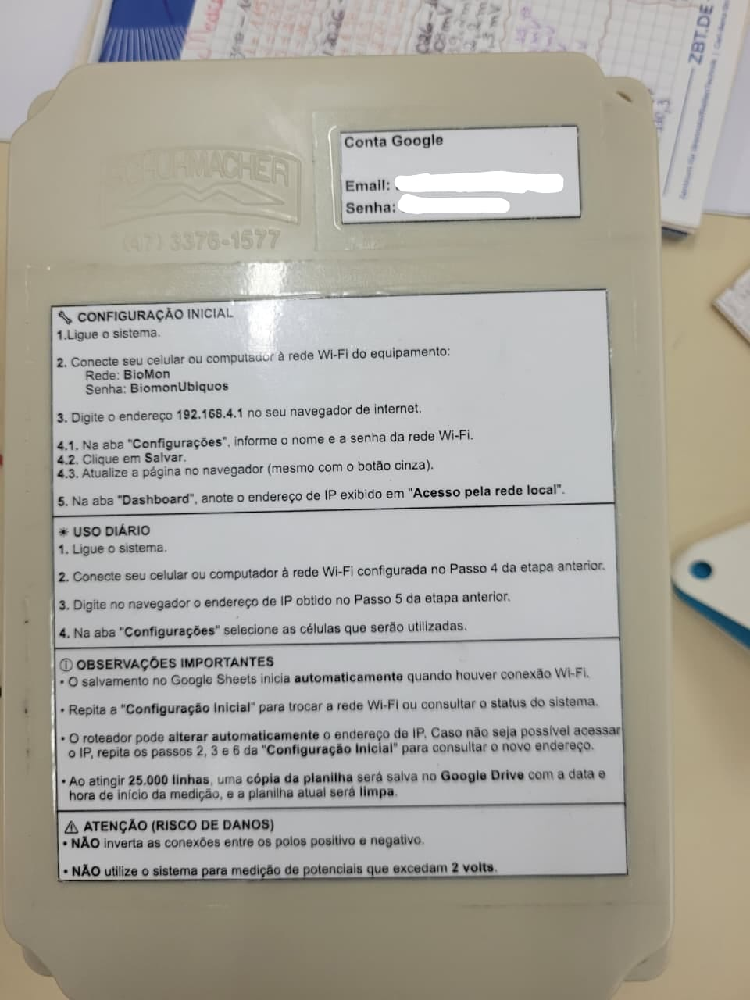
  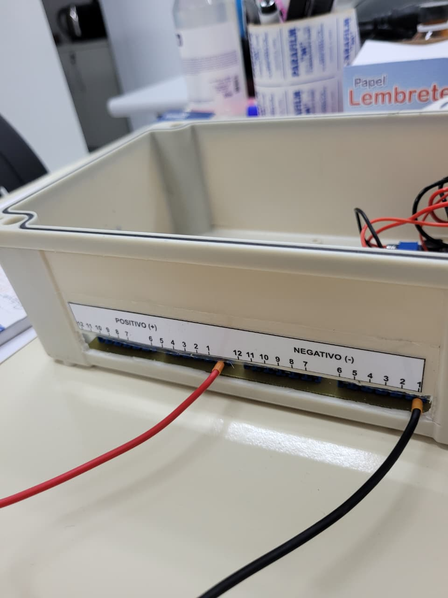

O firmware resultante (`wizard.ino`) cumpre com todos os requisitos funcionais estipulados:
*   **Modo Access Point & Station:** O ESP32 cria sua própria rede Wi-Fi e simultaneamente tenta conectar à rede local de internet do laboratório para despachar pacotes.
*   **Servidor Web Embarcado:** Permite acesso em tempo real via smartphone ou computador para visualizar um multímetro digital virtual, onde é possível configurar os parâmetros de conectividade e o intervalo da amostra.
*   **Nuvem:** Processa lotes ("batching") de amostras e despacha para uma planilha do **Google Sheets** periodicamente (evitando limitação de cota de chamadas de API).
*   **Memória:** Utiliza a biblioteca `Preferences` para armazenar persistentemente a rede e senhas setadas na interface.

### Interfaces e Visualização de Dados

Para o monitoramento local, o servidor web embarcado fornece uma interface amigável. A captura de tela a seguir exibe a Interface Web, que atua como um multímetro digital em tempo real e painel de configuração:

  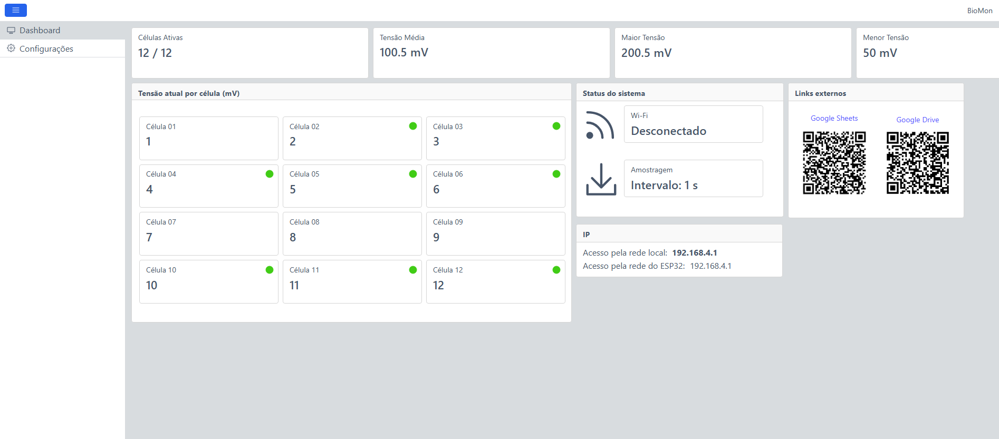
  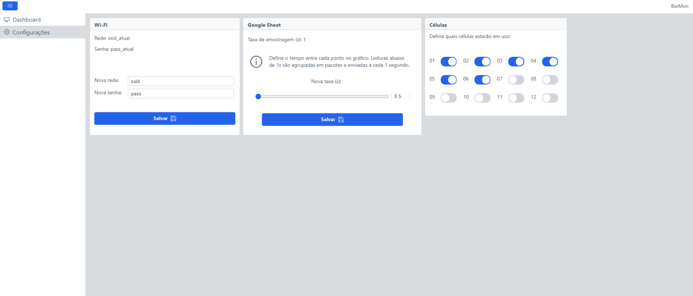

Os dados coletados são enviados automaticamente para a nuvem. A imagem abaixo mostra a Planilha no Google Sheets recebendo as leituras contínuas do sistema:

  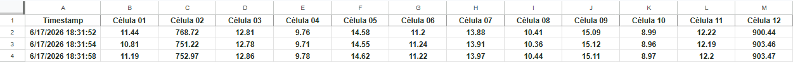

Com os dados estruturados na planilha, é possível gerar visualizações dinâmicas. A seguir, os gráficos no Google Sheets ilustrando o comportamento da tensão (bioeletricidade) gerada pelas células ao longo do tempo:

  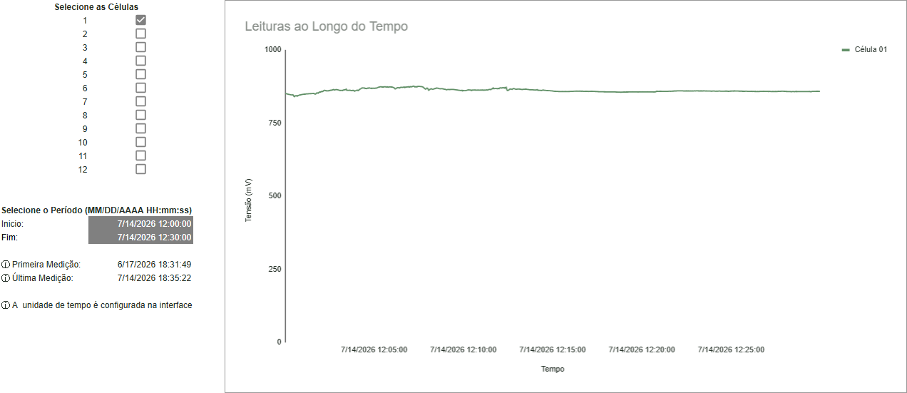

---

## 📝 Tutorial e Troubleshoot

O trabalho com grandezas bioeletroquímicas minúsculas exige atenção aos fatores de risco documentados. Abaixo listamos as soluções implementadas para problemas comuns de hardware/software:

*   **Problema de Estabilidade de Troca de Canais:** Trocar a chave do multiplexador gera flutuações rápidas capacitivas. 
    *   *Solução no Código:* Foi adicionado um `delay(2)` estratégico imediatamente após o `selectMux(ch)` para garantir que a rede elétrica dos fios até o ADS1115 estabilize antes da leitura ser registrada.
    *   *Solução no Código:* Filtro lógico via software para definir que a menor tensão válida do béquer seja 0.0mV, ignorando loops de indução parasita negativos.
*   **Perda de Conexão com o Google Sheets:** Em caso de queda do roteador do laboratório, o fluxo de loop era interrompido devido a travamentos de requisição de POST.
    *   *Solução no Código:* Uma rotina detecta perda de sinal (`WL_CONNECTED`), desliga o modo Station temporariamente para não congelar o microcontrolador, preservando o modo Ponto de Acesso e mantendo o servidor web funcionando localmente.
